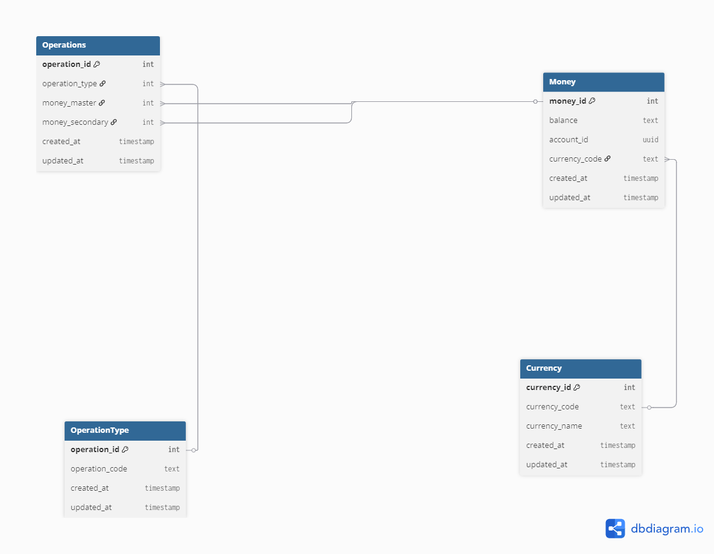

# 📘 Database Documentation — `OPERATION MS`

> Inspirado en convenciones usadas por equipos grandes (dbdocs/dbdiagram, GitOps, CI/CD con migraciones). Este documento sirve como **fuente única de verdad** para desarrolladores, QA, DevOps y analistas.

---

## 🧭 Tabla de contenido
- [Resumen](#-resumen)
- [Esquema lógico](#-esquema-lógico)
- [Tablas](#-tablas)
    - [Money](#1-money)
    - [Currency](#2-currency)
    - [OperationType](#3-operationtype)
    - [Operations](#4-operations)
- [Relaciones](#-relaciones)
- [DDL canónica](#-ddl-canónica)
- [Convenciones y buenas prácticas](#-convenciones-y-buenas-prácticas)
- [Índices recomendados](#-índices-recomendados)
- [Semillas (seed data)](#-semillas-seed-data)
- [Consultas de ejemplo](#-consultas-de-ejemplo)
- [Migraciones y CI/CD](#-migraciones-y-cicd)
- [Seguridad y accesos](#-seguridad-y-accesos)
- [Monitoreo y auditoría](#-monitoreo-y-auditoría)
- [Estrategias de pruebas](#-estrategias-de-pruebas)
- [Mejoras futuras (opcionales)](#-mejoras-futuras-opcionales)

---

## 🔎 Resumen
El sistema **Operation_Ms** gestiona saldos por cuenta y registra operaciones financieras entre dichos saldos, con soporte multimoneda. Se priorizan **tipos correctos** (p. ej., `DECIMAL` para dinero), **integridad referencial**, **auditoría** (`created_at`, `updated_at`) y **portabilidad** mediante DDL versionado.

### Objetivos clave
- Representar saldos por **cuenta** y **moneda** (`Money`).
- Catálogo de **monedas** (`Currency`) y **tipos de operación** (`OperationType`).
- Registro de **operaciones** entre saldos (`Operations`) con trazabilidad.

---

## 🧱 Esquema lógico

```text
Currency (currency_code) ────< Money (currency_code)

OperationType (operation_id) ────< Operations (operation_type)

Money (money_id) ────< Operations (money_master)
Money (money_id) ────< Operations (money_secondary)
```
> Notación `A ────< B` = A (padre) a B (hijo) relación 1:N.

---

## 📂 Tablas

### 1) Money
Contiene los saldos asociados a una cuenta en una moneda específica.

| Campo           | Tipo             | Restricciones                                       | Descripción |
|-----------------|------------------|-----------------------------------------------------|-------------|
| `money_id`      | INT              | **PK**, `IDENTITY(1,1)`                             | Identificador del registro de saldo. |
| `balance`       | DECIMAL(18,2)    | **NOT NULL**                                        | Saldo actual. Usa `DECIMAL` para evitar errores de coma flotante. |
| `account_id`    | UNIQUEIDENTIFIER | **NOT NULL**                                        | Identificador global de la cuenta (UUID). |
| `currency_code` | VARCHAR(10)      | **FK** → `Currency(currency_code)`, **NOT NULL**    | Código de moneda (`USD`, `PEN`, `EUR`, …). |
| `created_at`    | DATETIME2        | `DEFAULT SYSUTCDATETIME()`                          | Creación (UTC). |
| `updated_at`    | DATETIME2        | `DEFAULT SYSUTCDATETIME()`                          | Última actualización (UTC). |

> **Nota:** En sistemas bancarios, `DECIMAL(18,2)` es un estándar común. Ajustar escala según negocio (p. ej., 4 decimales para FX).

---

### 2) Currency
Catálogo de monedas soportadas.

| Campo           | Tipo           | Restricciones                         | Descripción |
|-----------------|----------------|---------------------------------------|-------------|
| `currency_id`   | INT            | **PK**, `IDENTITY(1,1)`               | Identificador interno. |
| `currency_code` | VARCHAR(10)    | **UNIQUE**, **NOT NULL**              | Código ISO o interno de moneda. |
| `currency_name` | VARCHAR(100)   | **NOT NULL**                          | Nombre visible. |
| `created_at`    | DATETIME2      | `DEFAULT SYSUTCDATETIME()`            | Creación (UTC). |
| `updated_at`    | DATETIME2      | `DEFAULT SYSUTCDATETIME()`            | Última actualización (UTC). |

---

### 3) OperationType
Catálogo de tipos de operación.

| Campo            | Tipo          | Restricciones              | Descripción |
|------------------|---------------|----------------------------|-------------|
| `operation_id`   | INT           | **PK**, `IDENTITY(1,1)`    | Identificador interno. |
| `operation_code` | VARCHAR(20)   | **NOT NULL**               | Código (`SUM`, `REST`, `TRANSFER`, …). |
| `created_at`     | DATETIME2     | `DEFAULT SYSUTCDATETIME()` | Creación (UTC). |
| `updated_at`     | DATETIME2     | `DEFAULT SYSUTCDATETIME()` | Última actualización (UTC). |

---

### 4) Operations
Eventos de operación entre saldos de `Money`.

| Campo             | Tipo      | Restricciones                                              | Descripción |
|-------------------|-----------|------------------------------------------------------------|-------------|
| `operation_id`    | INT       | **PK**, `IDENTITY(1,1)`                                    | Identificador del evento. |
| `operation_type`  | INT       | **FK** → `OperationType(operation_id)`, **NOT NULL**       | Tipo de operación. |
| `money_master`    | INT       | **FK** → `Money(money_id)`, **NOT NULL**                   | Saldo origen/primario. |
| `money_secondary` | INT       | **FK** → `Money(money_id)`, **NOT NULL**                   | Saldo destino/secundario. |
| `created_at`      | DATETIME2 | `DEFAULT SYSUTCDATETIME()`                                 | Creación (UTC). |
| `updated_at`      | DATETIME2 | `DEFAULT SYSUTCDATETIME()`                                 | Última actualización (UTC). |

---

## 🔗 Relaciones
- `Money.currency_code` → `Currency.currency_code`
- `Operations.operation_type` → `OperationType.operation_id`
- `Operations.money_master` → `Money.money_id`
- `Operations.money_secondary` → `Money.money_id`

---

## 🧾 DDL canónica
> Mantener este bloque **idéntico** a la versión productiva y versionarlo en migraciones (Liquibase/Flyway).

```sql
USE Operation_Ms;

CREATE TABLE Money (
    [money_id] INT PRIMARY KEY IDENTITY(1, 1),
    [balance] DECIMAL(18,2) NOT NULL,
    [account_id] UNIQUEIDENTIFIER NOT NULL,
    [currency_code] VARCHAR(10) NOT NULL,
    [created_at] DATETIME2 DEFAULT SYSUTCDATETIME(),
    [updated_at] DATETIME2 DEFAULT SYSUTCDATETIME()
);

CREATE TABLE [Currency] (
    [currency_id] INT PRIMARY KEY IDENTITY(1, 1),
    [currency_code] VARCHAR(10) UNIQUE NOT NULL,
    [currency_name] VARCHAR(100) NOT NULL,
    [created_at] DATETIME2 DEFAULT SYSUTCDATETIME(),
    [updated_at] DATETIME2 DEFAULT SYSUTCDATETIME()
);

CREATE TABLE [OperationType] (
    [operation_id] INT PRIMARY KEY IDENTITY(1, 1),
    [operation_code] VARCHAR(20) NOT NULL,
    [created_at] DATETIME2 DEFAULT SYSUTCDATETIME(),
    [updated_at] DATETIME2 DEFAULT SYSUTCDATETIME()
);

CREATE TABLE [Operations] (
    [operation_id] INT PRIMARY KEY IDENTITY(1, 1),
    [operation_type] INT NOT NULL,
    [money_master] INT NOT NULL,
    [money_secondary] INT NOT NULL,
    [created_at] DATETIME2 DEFAULT SYSUTCDATETIME(),
    [updated_at] DATETIME2 DEFAULT SYSUTCDATETIME()
);

ALTER TABLE [Money]
  ADD FOREIGN KEY ([currency_code]) REFERENCES [Currency] ([currency_code]);

ALTER TABLE [Operations]
  ADD FOREIGN KEY ([operation_type]) REFERENCES [OperationType] ([operation_id]);

ALTER TABLE [Operations]
  ADD FOREIGN KEY ([money_master]) REFERENCES [Money] ([money_id]);

ALTER TABLE [Operations]
  ADD FOREIGN KEY ([money_secondary]) REFERENCES [Money] ([money_id]);
```

---

## 🧩 Convenciones y buenas prácticas
- **Tipos de dinero**: `DECIMAL(18,2)` (o mayor escala si el negocio lo exige). Evitar `FLOAT/REAL`.
- **UTC** siempre en timestamps (`SYSUTCDATETIME()`).
- **Nombres** consistentes en inglés para entidades y campos; `snake_case` o `lowerCamelCase` en aplicaciones, **no mezclar** estilos en un mismo espacio.
- **Migraciones** atómicas y reversibles (Liquibase/Flyway) por PR, ligadas al versionado del servicio.
- **Idempotencia** a nivel de aplicación para operaciones financieras (p. ej., `operation_key` único por transacción si aplica).
- **Bloqueos**/aislamiento: para débitos/créditos concurrentes, utilizar transacciones con el aislamiento apropiado (p. ej., `REPEATABLE READ`/`SERIALIZABLE`) o patrones como **Outbox** + **sagas**.
- **Validaciones** en capa de dominio (p. ej., impedir saldo negativo si es política), y **CHECK constraints** cuando sea invariante duro del modelo.

---

## ⚡ Índices recomendados
> No cambian el modelo, solo mejoran performance de lecturas frecuentes.

```sql
-- Búsquedas por cuenta + moneda (consultas de saldo)
CREATE NONCLUSTERED INDEX IX_Money_Account_Currency
ON Money (account_id, currency_code);

-- Catálogo de operaciones (por código)
CREATE NONCLUSTERED INDEX IX_OperationType_Code
ON OperationType (operation_code);

-- Join rápido por tipo
CREATE NONCLUSTERED INDEX IX_Operations_OperationType
ON Operations (operation_type);

-- Access patterns de transferencias (origen / destino)
CREATE NONCLUSTERED INDEX IX_Operations_MoneyMaster ON Operations (money_master);
CREATE NONCLUSTERED INDEX IX_Operations_MoneySecondary ON Operations (money_secondary);
```

> **Opcional (regla de unicidad de negocio):** si el negocio exige **un saldo por (account_id, currency_code)**, agregar:
```sql
ALTER TABLE Money
ADD CONSTRAINT UQ_Money_Account_Currency UNIQUE (account_id, currency_code);
```

---

## 🌱 Semillas (seed data)
```sql
INSERT INTO Currency (currency_code, currency_name) VALUES
 ('USD', 'US Dollar'),
 ('PEN', 'Peruvian Sol'),
 ('EUR', 'Euro');

INSERT INTO OperationType (operation_code) VALUES
 ('SUM'), ('REST'), ('TRANSFER');
```

---

## 🔧 Consultas de ejemplo

### Crear saldo
```sql
INSERT INTO Money (balance, account_id, currency_code)
VALUES (1000.00, NEWID(), 'USD');
```

### Transferencia simple (esbozo transaccional)
> Ejemplo didáctico; la lógica de negocio e idempotencia se implementan en la capa de servicios.
```sql
BEGIN TRAN;

-- 1) Debitar origen
UPDATE m
   SET m.balance = m.balance - 50.00,
       m.updated_at = SYSUTCDATETIME()
  FROM Money m
 WHERE m.money_id = @money_master;

-- 2) Acreditar destino
UPDATE m
   SET m.balance = m.balance + 50.00,
       m.updated_at = SYSUTCDATETIME()
  FROM Money m
 WHERE m.money_id = @money_secondary;

-- 3) Registrar operación
INSERT INTO Operations (operation_type, money_master, money_secondary)
VALUES (@operation_type, @money_master, @money_secondary);

COMMIT;
```

> **Tip:** aplicar `SET TRANSACTION ISOLATION LEVEL SERIALIZABLE;` o usar **optimistic concurrency** (rowversion) según throughput/conflictos.

---

## 🚚 Migraciones y CI/CD
- **Liquibase/Flyway**: scripts versionados por PR, con etiquetas por release.
- **Entornos**: `dev` → `qa` → `stage` → `prod` con **gate** de aprobaciones.
- **Rollback**: cada cambio debe tener `--rollback` o script inverso.
- **Smoke tests**: verificación automática post-deploy (integridad FK, conteo tablas, etc.).

---

## 🔐 Seguridad y accesos
- **Principio de mínimo privilegio**: roles por responsabilidad (`reader`, `writer`, `admin`).
- Separar **esquema** lógico (p. ej., `public`/`dbo`) por dominio si crece.
- **Enmascaramiento**/cifrado de datos sensibles a nivel de columna cuando aplique.
- Auditoría de acciones privilegiadas (DDL/GRANT/REVOKE).

---

## 🩺 Monitoreo y auditoría
- Trazar métricas: TPS de `Operations`, latencias, deadlocks.
- Dashboard con **errores de FK**, y **lag** de replicación (si aplica).
- ETLs/backup: política de retención y restauraciones probadas periódicamente.

---

## 🧪 Estrategias de pruebas
- **Unit tests** de dominio (cálculos y reglas).
- **Contract tests** si este esquema es consumido por servicios (OpenAPI, CDC).
- **Data tests**: fixtures deterministas para QA.
- **Load tests** sobre consultas críticas: lectura de saldos y escrituras concurrentes.

---

## 🌟 Mejoras futuras (opcionales)
- `rowversion` en tablas mutables para **concurrencia optimista**.
- `CHECK` de negocio (p. ej., `balance >= 0` si aplica).
- Tabla `OperationLedger` con montos y metadatos por operación (importe, referencia externa, idempotency key).
- **Eventos Outbox** para publicarlos en Kafka tras confirmar la transacción SQL.
- Particionamiento por fecha si el volumen de `Operations` crece sustancialmente.

— Fin —
